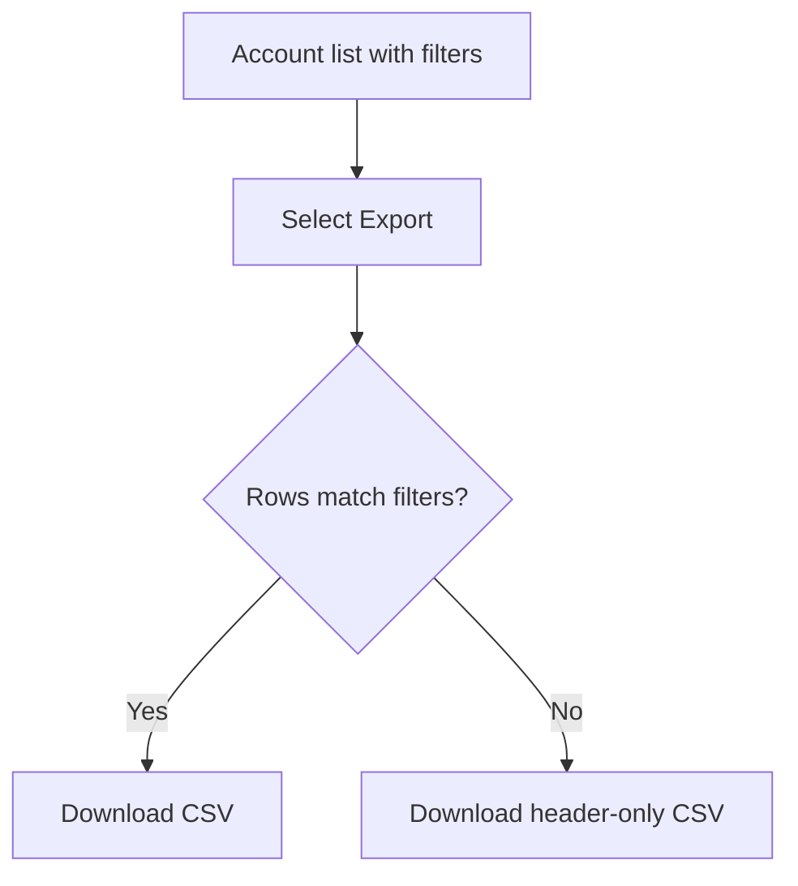
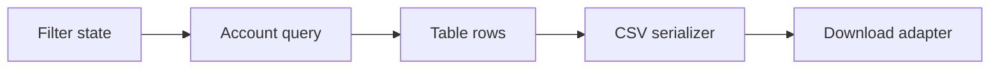
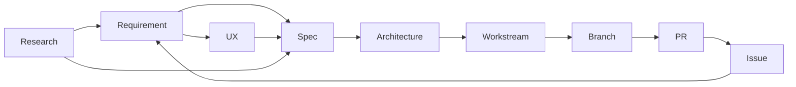

# Artifact Contract
This contract defines every durable document produced by the `software-team`
package. It refines `ROLES.md`, `OKF-PROFILE.md`, `LIFECYCLE.md`,
`GLOSSARY.md`, and `PARALLELISM.md`. Where this contract and `ROLES.md`
disagree, `ROLES.md` wins.
Every committed artifact is keyed to `REQ-NNN`. Every artifact can name its
parent Requirement. Every Requirement can enumerate its artifacts through
`links`.
## 1. Path map
| Document type | Owner | Path pattern |
|---|---|---|
| Requirement | Project-Lead | `docs/requirements/REQ-NNN-<slug>.md` |
| Research brief catalog | Research-Team | `docs/research/<topic-slug>/index.md` |
| Research brief | Research-Team | `docs/research/<topic-slug>/brief.md` |
| Research finding | Research-Team | `docs/research/<topic-slug>/<finding-slug>.md` |
| UX brief | UX-Team | `docs/ux/REQ-NNN/<feature-slug>.md` |
| Feature spec | PM-Team | `docs/specs/REQ-NNN/<feature-slug>.md` |
| Solution architecture | Architect-Team | `docs/architecture/REQ-NNN/solution.md` |
| ADR | Architect-Team | `docs/architecture/decisions/ADR-NNN-<slug>.md` |
| Development principle | Architect-Team | `docs/architecture/principles/<slug>.md` |
| Workstream record | Project-Lead | `.software-team/REQ-NNN/workstreams.md` |
## 2. Global rules
- Non-reserved concept documents carry OKF frontmatter with non-empty `type`.
- Bundle-root `index.md` files carry only `okf_version: "0.2"`.
- Nested `index.md` files carry no frontmatter.
- `generated.by` names the writer. `owner` names the accountable team.
- Timestamps use ISO-8601 with an explicit UTC offset.
- OKF `status` is `draft`, `stable`, or `deprecated`; it is not lifecycle.
- Unknowns are written as `unknown` in the body. Do not invent them.
- Teams write only their owned paths. Project-Lead updates Requirement reverse links.
## 3. Requirement
**Owner:** Project-Lead.  
**Path:** `docs/requirements/REQ-NNN-<slug>.md`.  
### 3.1 Frontmatter
```yaml
---
id: REQ-001                         # Zero-padded, monotonic, never reused.
title: Export filtered account data # Short stakeholder-readable title.
description: Export filtered account data to CSV from the account list.
type: Requirement
lifecycle: draft                    # draft | in-review | approved | in-discovery | in-spec | in-architecture | ready-for-dev | in-dev | in-acceptance | delivered | parked | blocked
status: draft                       # OKF status derived from lifecycle.
priority: P2                        # P0 | P1 | P2 | P3.
version: 1                          # Integer compare-and-swap version.
owner: team:project-lead
generated: { by: software-team-project-lead/0.1.0, at: 2026-09-20T22:00:00Z }
approved_at:                        # ISO-8601 timestamp; blank until approval.
approved_by:                        # human:<login>; blank until approval.
verified: { by: human:alex-owner, at: 2026-09-20T22:15:00Z } # Omit until real verification exists.
requirement_issue:                  # GitHub Requirement issue URL.
links: { requirement_pr:, project_item:, research: [], ux: [], specs: [], architecture: [], workstreams: [], child_issues: [], prs: [] } # research, ux, architecture, and workstreams are additions versus legacy schema.
---
```
### 3.2 Body template
```markdown
# REQ-001 — <title>
## Problem / Context — <why this matters; the situation today>
## Desired outcome (goal) — <what better looks like>
## Scope — in — <what this requirement covers>
## Scope — out (non-goals) — <explicit exclusions>
## Acceptance / success criteria
- **AC-1:** <testable criterion>
- **AC-2:** <testable criterion>
## Constraints & assumptions — <constraints and assumptions>
## Open questions — None.
## Change log
- [2026-09-20T22:00:00Z] v1 — created as draft.
```
### 3.3 Rules
- Acceptance criteria are numbered `AC-<n>` and testable.
- Open questions must be empty before approval. Use `None.` when empty.
- Every lifecycle change appends to Change log and increments `version`.
- Project-Lead alone allocates zero-padded, monotonic, never-reused `REQ-NNN`.
- `research[]`, `ux[]`, `architecture[]`, and `workstreams[]` are required so
  downstream teams can find all Requirement artifacts.
### 3.4 Worked example
```markdown
---
id: REQ-014
title: CSV export for filtered accounts
type: Requirement
lifecycle: approved
status: stable
version: 3
links: { research: [docs/research/csv-export-options/browser-download.md], ux: [docs/ux/REQ-014/account-export.md], specs: [docs/specs/REQ-014/account-export.md], architecture: [docs/architecture/REQ-014/solution.md], workstreams: [.software-team/REQ-014/workstreams.md#req-014ws1], child_issues: [https://github.com/example/repo/issues/42], prs: [] }
---
## Acceptance / success criteria
- **AC-1:** Given active filters, Export creates a CSV containing only matching rows.
- **AC-2:** Given zero matching rows, Export creates a CSV with headers and zero data rows.
```

## 4. Research brief
**Owner:** Research-Team.  
**Paths:** `docs/research/<topic-slug>/index.md` and
`docs/research/<topic-slug>/brief.md`.  
`index.md` is a no-frontmatter catalog. `brief.md` is typed.

### 4.1 Frontmatter for `brief.md`
```yaml
---
type: Research Brief
title: CSV export implementation options
description: Research browser and server approaches for exporting filtered data.
owner: team:research-team
req: REQ-014                         # Required once attached to committed delivery.
topic: csv-export-options
commissioned_by: team:project-lead
commissioned_question: Which export approach best fits filtered account data?
scope: { in: [browser download behavior, server-side streaming options], out: [spreadsheet formatting beyond CSV] }
constraints: [must preserve active account filters, must work in supported browsers]
good_answer: [names viable options, states trade-offs, records unknowns]
generated: { by: software-team-research/0.1.0, at: 2026-09-20T22:25:00Z }
status: draft
---
```
### 4.2 Body templates
```markdown
# docs/research/<topic-slug>/index.md
- [Brief](brief.md) - Commissioned question and scope.
- [<finding title>](<finding-slug>.md) - One-line finding summary.
```
```markdown
# Research brief — <topic>
## Commissioned question — <the exact question>
## Scope
### In — <included topics>
### Out — <excluded topics>
## Constraints — <constraints>
## What a good answer looks like — <observable qualities of a useful answer>
## Handoff target — <requirement, team, or decision this research informs>
```
### 4.3 Rules
- A brief defines the question. It does not answer it.
- If the brief predates a Requirement, Project-Lead sets `req` before attachment.
- Scope always has in and out entries. Constraints are inputs, not findings.
### 4.4 Worked example
```markdown
---
type: Research Brief
title: CSV export implementation options
owner: team:research-team
req: REQ-014
topic: csv-export-options
commissioned_by: team:project-lead
commissioned_question: Which export approach preserves filters and scales for account lists?
scope: { in: [browser downloads, server streaming], out: [xlsx reports] }
good_answer: [lists options, cites sources, records unknowns]
status: stable
---
```

## 5. Research finding
**Owner:** Research-Team.  
**Path:** `docs/research/<topic-slug>/<finding-slug>.md`.  

### 5.1 Frontmatter
```yaml
---
type: Research Finding
title: Browser downloads support generated CSV files
description: Native browser downloads can save generated CSV content without a server file.
owner: team:research-team
req: REQ-014
topic: csv-export-options
brief: docs/research/csv-export-options/brief.md
question: Can a browser save generated CSV content as a file?
confidence: medium                  # high | medium | low.
generated: { by: software-team-research/0.1.0, at: 2026-09-20T22:30:00Z }
status: stable
sources:
  - { id: mdn-download, resource: https://developer.mozilla.org/docs/Web/HTML/Element/a, title: HTML anchor download attribute, author: team:mdn-docs, usage_count: 2, last_modified: 2026-09-01T00:00:00Z }
usage_window: { from: 2026-09-01T00:00:00Z, to: 2026-09-20T23:59:59Z } # Optional.
---
```
### 5.2 Body template
```markdown
# <finding title>
## Question — <one question>
## Finding — <answer with footnotes on every load-bearing claim>
## Evidence — <source-specific evidence>
## Confidence — <high | medium | low> — <one-sentence justification>
## Limitations — <unknowns and evidence gaps>
## Implications — <what this means downstream>
[^source-id]: <citation note matching sources[].id>
```
### 5.3 Rules
- `sources[]` is mandatory. A finding with no source is not a finding.
- `usage_window` is optional and is a sibling of `sources`.
- Every load-bearing claim carries a footnote whose label matches `sources[].id`.
- Unknowns are recorded as unknowns, never as speculation presented as evidence.
- `confidence` is `high`, `medium`, or `low` and is justified in the body.
### 5.4 Worked example
```markdown
## Finding
The HTML `download` attribute tells the browser to download the linked resource
and may provide a suggested filename.[^mdn-download]
## Confidence
medium — The source is authoritative for browser behavior, but repository-specific browser support is not yet verified.
[^mdn-download]: MDN documents the anchor `download` attribute and filename suggestion behavior.
```

## 6. UX brief
**Owner:** UX-Team.  
**Path:** `docs/ux/REQ-NNN/<feature-slug>.md`.  

### 6.1 Frontmatter
```yaml
---
type: UX Brief
title: REQ-014 — Account export experience
description: User flow and states for exporting filtered account data.
owner: team:ux-team
req: REQ-014
feature: account-export
surface: user-visible              # user-visible | none.
research: [docs/research/csv-export-options/browser-download.md]
status: stable
generated: { by: software-team-ux/0.1.0, at: 2026-09-20T22:35:00Z }
---
```
### 6.2 Body template
```markdown
# REQ-NNN — <feature> UX brief
## User and context — <who uses it and when>
## Primary flow — <ordered normal path>
## Alternate and error flows — <alternate paths, errors, empty states, cancellation>
## Wireframes — <Mermaid or ASCII diagrams inline>
## States and transitions — <states and transition rules>
## Accessibility notes — <keyboard, screen reader, contrast, focus, motion, language>
## Open questions — None.
```
### 6.3 Rules
- Wireframes are Mermaid or ASCII, inline, so they live in the repo.
- UX-Team may withdraw when there is no user-visible surface.
- Open questions name who can answer them. UX defines interaction, not implementation.
### 6.4 Worked examples

```text
+-----------------------------------------+
| Accounts                         Export |
| Filter: Status = Active                 |
| Acme Corp       Active          $120.00 |
+-----------------------------------------+
```
Withdrawal record:
```yaml
---
type: UX Brief
title: REQ-021 — No user-visible surface for audit log retention
owner: team:ux-team
req: REQ-021
feature: audit-log-retention
surface: none
withdrawal_reason: Backend retention policy has no direct user interaction, message, screen, or workflow.
status: stable
---
```
```markdown
## User and context — No user-visible surface.
## Primary flow — No UX flow is created.
## Wireframes — No wireframe applies.
## Open questions — None.
```

## 7. Feature spec
**Owner:** PM-Team.  
**Path:** `docs/specs/REQ-NNN/<feature-slug>.md`.  

### 7.1 Frontmatter
```yaml
---
type: Feature Spec
title: REQ-014 — Account export
description: Feature specification for exporting filtered account data as CSV.
owner: team:pm-team
req: REQ-014
feature: account-export
ux: [docs/ux/REQ-014/account-export.md]
research: [docs/research/csv-export-options/browser-download.md]
status: stable
generated: { by: software-team-pm/0.1.0, at: 2026-09-20T22:45:00Z }
---
```
### 7.2 Body template
```markdown
# REQ-NNN — <feature title>
## Problem — <problem this feature solves>
## Goal — <observable outcome>
## Non-goals
- <excluded item>
## User stories
### US-1: <title>
Traces to: REQ-NNN AC-<n>
**As a** <user role>
**I want** <capability>
**So that** <outcome>
**Acceptance criteria:**
- [ ] <specific, testable, unambiguous criterion>
## Dependencies — <dependency or "None.">
## Risks and open questions — <risk or question, or "None.">
## Out-of-scope clarifications — <clarification or "None.">
```
### 7.3 Rules
- Every story uses `As a` / `I want` / `So that`.
- Every story has at least one checkbox acceptance criterion.
- Every criterion is specific, testable, unambiguous, and one check.
- Criteria reference concrete inputs and outputs.
- Subjective phrasing such as `works correctly` or `user is happy` is prohibited.
- Every story traces to at least one Requirement `AC-<n>` and states which.
- New scope returns to Project-Lead as an impediment.
### 7.4 Worked example
```markdown
### US-1: Export filtered account rows
Traces to: REQ-014 AC-1, AC-2
**As a** support operator
**I want** to export the account list using active filters
**So that** I can share exactly the rows I am reviewing
**Acceptance criteria:**
- [ ] Given Status is filtered to Active, the CSV contains only rows whose Status column is Active.
- [ ] Given zero rows match active filters, the CSV contains the header row and zero data rows.
```

## 8. Solution architecture
**Owner:** Architect-Team.  
**Path:** `docs/architecture/REQ-NNN/solution.md`.  

### 8.1 Frontmatter
```yaml
---
type: Solution Architecture
title: REQ-014 — Account export solution architecture
description: Technical architecture for CSV export delivery.
owner: team:architect-team
req: REQ-014
specs: [docs/specs/REQ-014/account-export.md]
research: [docs/research/csv-export-options/browser-download.md]
adrs: [docs/architecture/decisions/ADR-006-client-side-csv-export.md]
principles: [docs/architecture/principles/export-tests-cover-empty-results.md]
status: stable
generated: { by: software-team-architect/0.1.0, at: 2026-09-20T22:50:00Z }
---
```
### 8.2 Body template
```markdown
# REQ-NNN — Solution architecture
## Context and drivers — <requirement, specs, constraints, quality drivers>
## Component view — <components and responsibilities; include at least one Mermaid diagram>
## Interfaces and contracts — <inputs, outputs, APIs, events, files, commands>
## Data model — <entities, fields, transformations, persistence, retention>
## Sequence for the primary flow — <Mermaid sequence or ordered technical sequence>
## Alternatives considered and why rejected — <option and reason>
## Risks — <technical risks and mitigations>
## Impact on existing system — <code, data, behavior, dependency, operations impact>
## Open questions — None.
```
### 8.3 Rules
- At least one Mermaid diagram is required.
- Interfaces name concrete inputs, outputs, and ownership boundaries.
- Alternatives state why rejected.
- Development principles derive from this architecture or ADRs.
### 8.4 Worked example

Example contract: CSV serializer input is ordered visible account rows; output is
a UTF-8 CSV string with stable header order.

## 9. ADR
**Owner:** Architect-Team.  
**Path:** `docs/architecture/decisions/ADR-NNN-<slug>.md`.  

### 9.1 Frontmatter
```yaml
---
type: Decision
title: ADR-006 — Use client-side CSV generation
description: Decide where filtered account CSV files are generated.
owner: team:architect-team
adr: ADR-006
req: REQ-014
status: stable
generated: { by: software-team-architect/0.1.0, at: 2026-09-20T22:55:00Z }
---
```
### 9.2 Body template
```markdown
# ADR-NNN — <decision title>
## Status — <proposed | accepted | superseded by ADR-NNN>
## Context — <forces and constraints>
## Decision — <selected option>
## Alternatives
- <alternative and why it was not selected>
## Consequences
### Positive
- <benefit>
### Negative
- <cost, limitation, or trade-off; required and non-empty>
## Related — <requirements, specs, architecture, principles, ADRs>
```
### 9.3 Rules
- An ADR records one decision.
- Body `Status` is decision state, not OKF `status`.
- Negative consequences are required and non-empty.
- Related links include the Requirement when the decision is requirement-specific.
### 9.4 Worked example
```markdown
## Decision
Generate CSV from the already-filtered client-side row model.
## Consequences
### Positive
- The export uses the same filter state the operator sees in the table.
### Negative
- Very large exports may require a server-side design in a future Requirement.
```

## 10. Development principle
**Owner:** Architect-Team.  
**Path:** `docs/architecture/principles/<slug>.md`.  
**Binding force:** Development principles are **BINDING ON DEV-TEAM**. Dev-Team
must follow every principle whose `applies_to` glob matches its file scope.

### 10.1 Frontmatter
```yaml
---
type: Development Principle
title: Export tests cover empty results
description: Export behavior must be tested for empty filtered result sets.
owner: team:architect-team
req: REQ-014                         # Optional only for repository-wide principles.
applies_to: [src/accounts/**, tests/accounts/**]
enforcement: must                    # must | should.
source_decisions: [docs/architecture/REQ-014/solution.md, docs/architecture/decisions/ADR-006-client-side-csv-export.md]
status: stable
generated: { by: software-team-architect/0.1.0, at: 2026-09-20T23:00:00Z }
---
```
### 10.2 Body template
```markdown
# <principle title>
## Principle — <one imperative sentence>
## Rationale — <trace to a real constraint, solution architecture section, or ADR>
## What compliance looks like
- <observable compliant behavior>
## What violation looks like
- <observable non-compliant behavior>
## How it is checked — <concrete command where possible>
## Exceptions — <who may grant an exception and how it is recorded>
```
### 10.3 Rules
- A principle with no traceable driver is not permitted.
- `enforcement` is `must` or `should`.
- `applies_to` contains globs.
- The principle sentence is imperative.
- Checks name concrete commands when the repository has them.
- Exceptions are explicit and recorded.
### 10.4 Worked examples
Coding standard:
```markdown
# Keep CSV serialization isolated
## Principle — Put account CSV serialization behind one named export module.
## Rationale — The solution architecture separates table state, serialization, and download.
## How it is checked — `rg "text/csv|download" src/accounts tests/accounts`
```
Testing standard:
```markdown
# Test empty export results
## Principle — Test the export path with zero matching rows.
## Rationale — REQ-014 AC-2 requires a header-only CSV when no rows match active filters.
## How it is checked — `uv run pytest tests/accounts -k export`
```

## 11. Workstream record
**Owner:** Project-Lead.  
**Path:** `.software-team/REQ-NNN/workstreams.md`.  

### 11.1 Frontmatter
```yaml
---
type: Workstream
title: REQ-014 — Workstreams
description: Workstream decomposition and delivery state for REQ-014.
owner: team:project-lead
req: REQ-014
status: stable
generated: { by: software-team-project-lead/0.1.0, at: 2026-09-20T23:10:00Z }
workstreams:
  - { workstream_id: REQ-014/ws1, req: REQ-014, title: Implement account export flow, stories: [REQ-014-US-1], file_scope: [src/accounts/export/**, tests/accounts/export/**], depends_on: [], team_id: dev-team-REQ-014-ws1, status: pending } # status values are defined by PARALLELISM.md.
---
```
### 11.2 Body template
```markdown
# REQ-NNN — Workstreams
## Decomposition summary — <why these workstreams are independent and sufficient>
## Workstreams
### REQ-NNN/ws1 — <title>
- Stories: <story ids>
- File scope: <glob list>
- Depends on: <workstream ids or None>
- Team id: <team id>
- Status: <state>
## Dependency order — <valid execution order>
## File-scope validation — <statement that scopes do not intersect, with check method>
## Change log
- [<timestamp>] v1 — Project-Lead created workstream record.
```
### 11.3 Rules
- All fields shown in each workstream record are mandatory.
- `workstream_id` uses full form `REQ-NNN/ws<k>`.
- `file_scope[]` is declared before dispatch and must not overlap another workstream.
- Dev-Team may read outside `file_scope[]`; it may not write outside it.
- `depends_on[]` contains workstream ids that must be accepted first.
- Project-Lead records workstreams only after requirements, specs, architecture,
  and development principles exist.
### 11.4 Worked example
```markdown
## File-scope validation
`src/accounts/export/**` and `tests/accounts/export/**` are not assigned to any
other REQ-014 workstream.
```

## 12. Naming conventions
| Item | Convention | Example |
|---|---|---|
| Slug | Kebab-case, 2-5 words, specific | `account-export` |
| Requirement id | `REQ-NNN`, zero-padded, monotonic, never reused | `REQ-014` |
| Workstream id | Local `ws<k>`; full `REQ-NNN/ws<k>` | `REQ-014/ws1` |
| Story id | `US-<n>` in a spec; prefixed across documents | `REQ-014-US-1` |
| ADR id | `ADR-NNN`, zero-padded, monotonic | `ADR-006` |
| Feature branch | Sibling branch `users/<you>/REQ-NNN-ws<k>` | `users/alex/REQ-014-ws1` |
| Task branch | Sibling branch `users/<you>/REQ-NNN-ws<k>-task-<n>` | `users/alex/REQ-014-ws1-task-2` |
| Nested branch form | Never use a path segment under the feature branch | Do not use `users/alex/REQ-014-ws1/task-2` |
| GitHub issue and PR titles | Defined by `GITHUB-INTEGRATION.md` | Requirement, Feature, Story, and PR titles |
| Commit message | `<type>(REQ-NNN): <imperative summary>` | `feat(REQ-014): add filtered account export` |
| Requirement document | `REQ-NNN-<slug>.md` | `REQ-014-csv-export.md` |
| Spec document | `docs/specs/REQ-NNN/<feature-slug>.md` | `docs/specs/REQ-014/account-export.md` |

## 13. Traceability chain
### 13.1 Invariant
Every artifact can name its parent Requirement, and every Requirement can
enumerate its artifacts. Forward links live in artifact frontmatter. Reverse
links live in the Requirement `links` object.
### 13.2 Diagram

### 13.3 Link table
| From | To | Field carrying the link | Reverse field on Requirement |
|---|---|---|---|
| Research brief | Requirement | `req` | `links.research[]` |
| Research finding | Requirement | `req` | `links.research[]` |
| Requirement | UX brief | `links.ux[]` | same field |
| UX brief | Requirement | `req` | `links.ux[]` |
| Requirement | Feature spec | `links.specs[]` | same field |
| Feature spec | Requirement | `req` | `links.specs[]` |
| Feature spec | UX brief | `ux[]` | `links.ux[]` |
| Feature spec | Research finding | `research[]` | `links.research[]` |
| Solution architecture | Requirement | `req` | `links.architecture[]` |
| Solution architecture | Specs | `specs[]` | `links.specs[]` |
| ADR | Requirement | `req` when requirement-specific | `links.architecture[]` |
| Development principle | Requirement | `req` when requirement-specific | `links.architecture[]` |
| Workstream record | Requirement | `req` | `links.workstreams[]` |
| Workstream record | Stories | `workstreams[].stories[]` | `links.workstreams[]` |
| Branch | Workstream | Branch name `REQ-NNN-ws<k>` | `links.workstreams[]` |
| PR | Workstream | GitHub PR title defined by `GITHUB-INTEGRATION.md` and PR body workstream link | `links.prs[]` |
| Issue | Requirement | Issue title `[REQ-NNN]` and body doc link | `requirement_issue` |
| Feature or story issue | Requirement issue | Native parent-child issue relation | `links.child_issues[]` |
### 13.4 Update rule
When a team creates or changes an artifact, it updates only the artifact it owns
and reports the path in its handoff envelope. Project-Lead updates Requirement
links and board projection. Teams do not edit another team's bundle.
